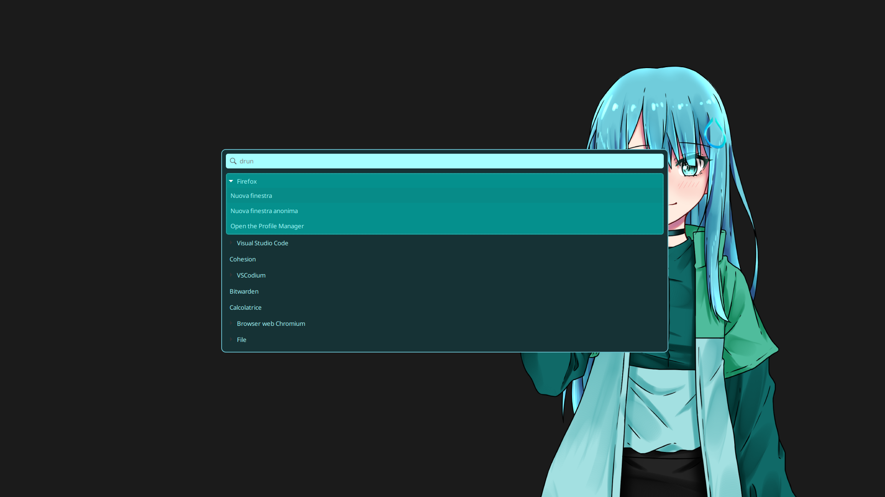
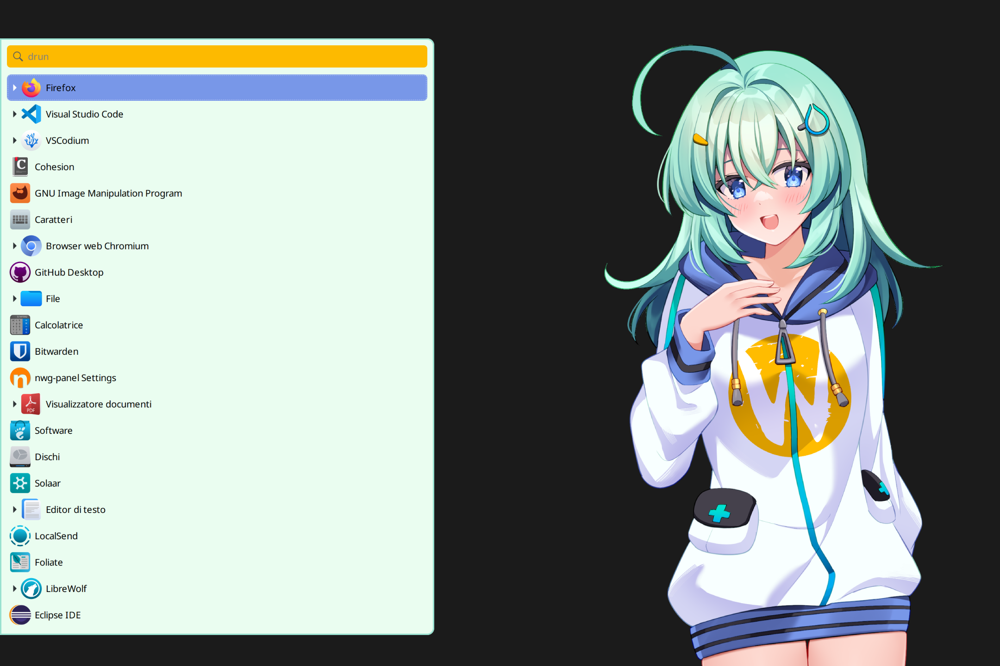

# 🌈 Wofi Themes

A curated collection of beautiful themes for Wofi, the GTK-based application launcher for Wayland.

## 🖼️ image

### ∞ harmony


### ⛩️ anime


### 🔜 coming soon...

---

## 📦 How to Install a Theme

Follow these steps to apply your favorite Wofi theme:

### 1. Clone the Repository

```bash
git clone https://github.com/MarcoFabrini/Wofi_Themes.git
cd Wofi_Themes
```

### 2. Ensure the Wofi config directory exists

```bash
mkdir -p ~/.config/wofi
```

### 3. Copy the theme you want

Replace `<theme-name>` with the name of the theme file you want to use:

```bash
cp themes/<theme-name>.css ~/.config/wofi/style.css
```

> 🎨 Tip: You can preview themes in the `images/` folder to choose the one that suits your style.

---

### 4. Copy the config file you want

Replace `<config-name>` with the name of the config file you want to use:

```bash
cp config/<config-name> ~/.config/wofi/config
```
---

## 🚀 Launch Wofi

Now when you launch Wofi, it will use your selected theme. Enjoy the new look!
